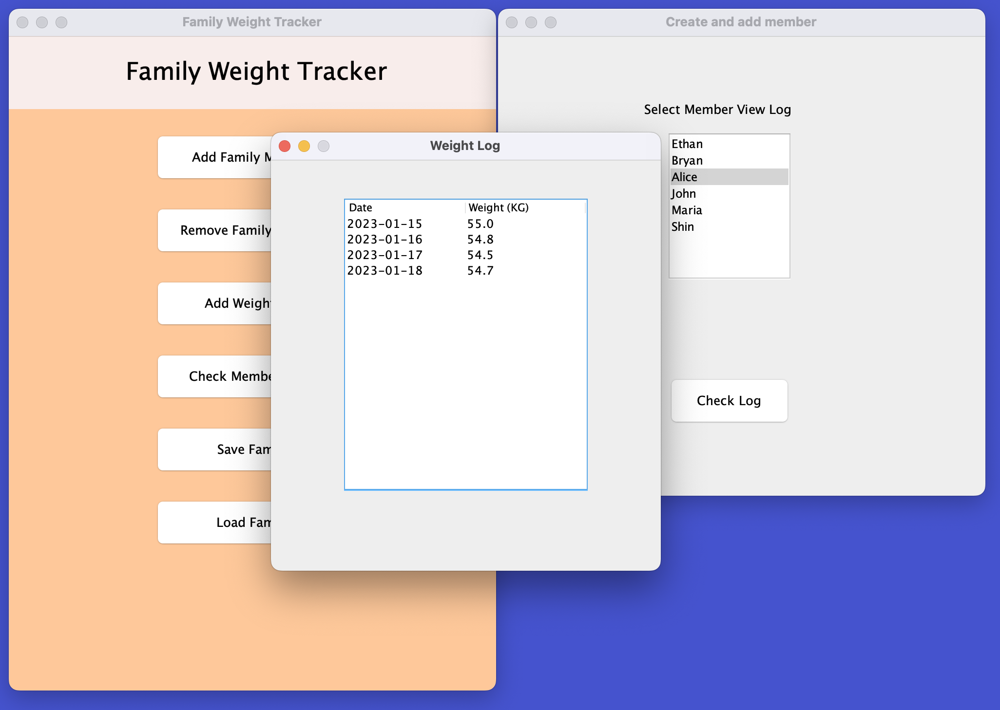

# Family Weight Tracker App

The goal of this program is to help family members track and compare their progress in weight loss. While creating this app, my main focus is on simplicity and user experience. This is because at the core of tracking weight loss, it can be achieved using pen and paper. I will not overcomplicate the process and will let the user incorporate the app as seamlessly as possible into their weight loss journey.

## App Functionality
- [X] Create new user with name and height information
- [X] Manage one's weight and add new weight logs
- [X] Access and view the progress between family members

## Target Userbase
I made this app to mainly help my family members lose weight. It is targeted towards groups of people who will be living together, but it can also be used by individuals as well.

## User Stories
As a user, I want to...
- [X] Create and add members to my family
- [X] Remove certain members from the family
- [X] View the record of a family member's weight log
- [X] Add weight log entries to a chosen member
- [X] Be able to save and load the record of family weight logs

## Sample output:
*Console*
```
Add Weight Log: 72.0 KG to Ethan
Add Weight Log: 65.0 KG to Bryan
```

*GUI*



## UML Diagram


## Improvements for the future
- [ ] Currently, the GUI handles the list of members. I would create another class called `Family` to handle the list of members.
- [ ] Separate the GUI class into several smaller classes instead of having one big GUI class.
